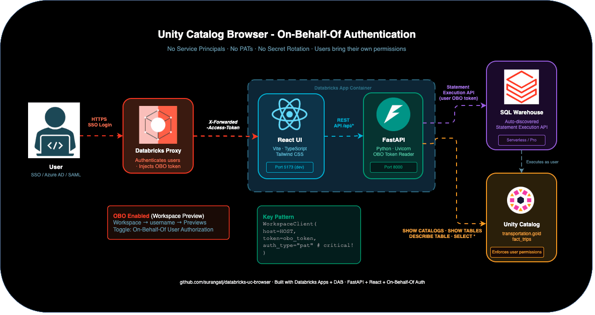
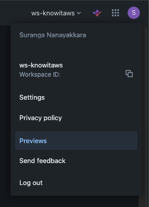
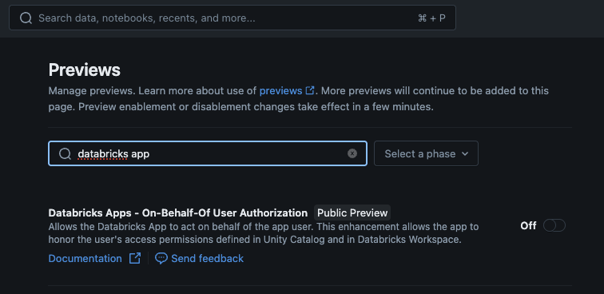
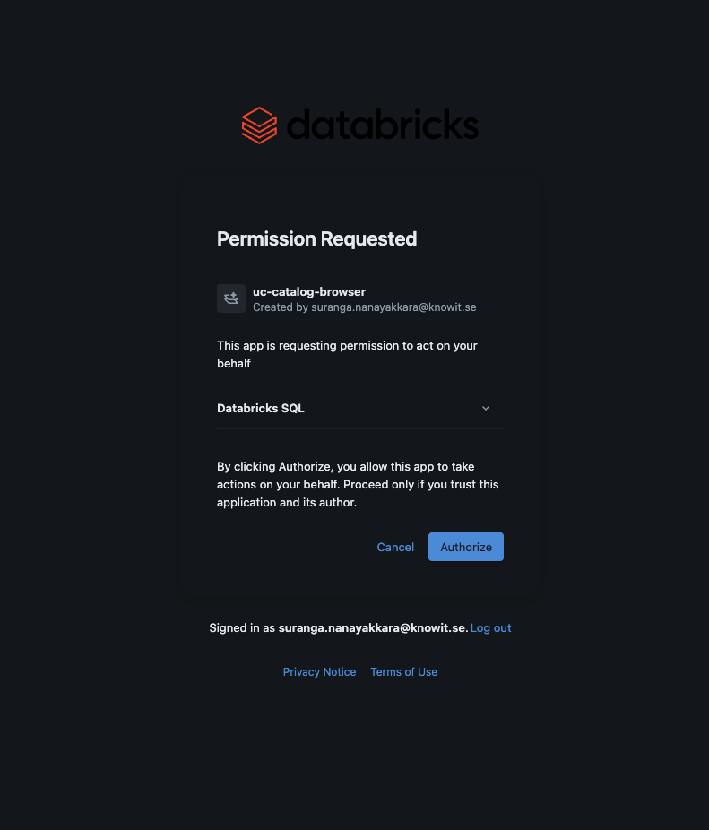
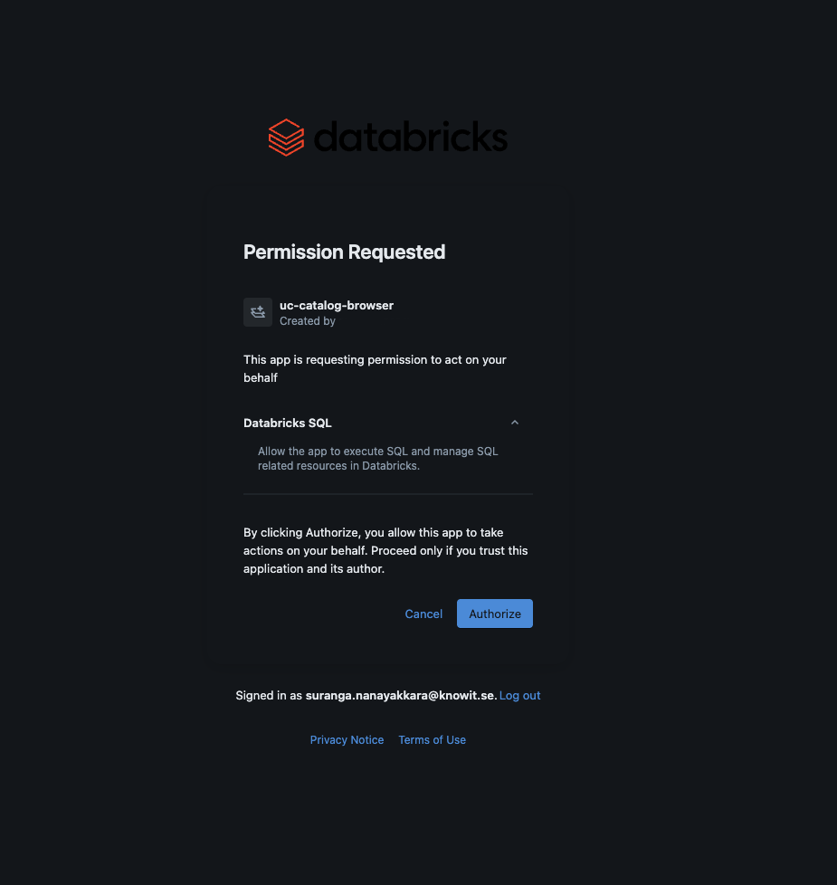

# Databricks Unity Catalog Browser

A React + FastAPI app that lets users browse Unity Catalog and run SQL queries - as themselves. No service principals, no PATs, no shared credentials.

Built on **Databricks Apps On-Behalf-Of (OBO)** user authorization.



---

## What It Does

- Browse catalogs, schemas, and tables you have access to
- View table schema and sample data
- Run ad-hoc SQL queries
- Every query runs as the logged-in user - Unity Catalog enforces their permissions

---

## Why OBO

The traditional approach uses a service principal with its own credentials and permissions. Everyone gets the same access level, audit logs show the SP not the user, and credentials need rotation.

With OBO, the Databricks proxy injects the logged-in user's OAuth token into every request via `X-Forwarded-Access-Token`. Your app picks it up and uses it - no credentials to manage.

```python
def get_client(request: Request) -> WorkspaceClient:
    token = request.headers.get("X-Forwarded-Access-Token")
    if token:
        return WorkspaceClient(host=HOST, token=token, auth_type="pat")
    return WorkspaceClient()  # local dev fallback
```

---

## Stack

| Layer | Tech |
|---|---|
| Frontend | React + Vite + TypeScript + Tailwind CSS |
| Backend | FastAPI + Python + Databricks SDK |
| Auth | Databricks Apps OBO (X-Forwarded-Access-Token) |
| Deploy | Databricks Asset Bundles (DAB) |
| CI/CD | GitHub Actions |

---

## Quick Start

**Prerequisites:** Databricks CLI, Node.js 18+, Python 3.10+

```bash
# 1. Clone and configure
git clone https://github.com/surangatj/databricks-uc-browser
cd databricks-uc-browser

# Edit databricks.yml - set your workspace host

# 2. Authenticate
databricks auth login --host https://your-workspace.cloud.databricks.com

# 3. Build frontend
cd apps/uc_browser/frontend && npm install && npm run build && cd ../../..

# 4. Deploy
databricks bundle deploy -t dev
databricks bundle run -t dev uc_browser
```

**Enable OBO (one-time, workspace admin):**
1. Click your username (top right) -> Previews
2. Toggle **"Databricks Apps - On-Behalf-Of User Authorization"** ON
3. Stop and restart the app to pick up the new token scope

First-time users will see a one-time consent screen, then land directly in the app.

---

## Project Structure

```
databricks-uc-browser/
├── databricks.yml                  # DAB bundle config
├── apps/uc_browser/
│   ├── main.py                     # FastAPI backend
│   ├── app.yaml                    # App startup command
│   ├── requirements.txt
│   ├── .databricksignore           # Excludes frontend/ from upload
│   └── frontend/                   # React source (not uploaded)
│       ├── vite.config.ts          # outDir: '../static'
│       └── src/
│           ├── App.tsx
│           ├── api.ts
│           └── components/
└── .github/workflows/deploy.yml    # Build + deploy on push to main
```

---

## Gotchas

**`more than one authorization method configured`**
Pass `auth_type="pat"` when constructing the client with the OBO token.

**Frontend not built / "Preparing source code" hangs**
`package.json` in the upload triggers `npm install` at startup. The `.databricksignore` excludes `frontend/` - build output goes to `static/` via `outDir: '../static'` in `vite.config.ts`.

**`unity-catalog` scope error**
The UC SDK APIs require a scope that isn't valid in `user_api_scopes`. Use SQL instead - `SHOW CATALOGS`, `SHOW SCHEMAS IN`, `SHOW TABLES IN`, `DESCRIBE TABLE`. Only the `sql` scope is needed.

**DAB ignores your built frontend**
DAB respects `.gitignore`. If `apps/*/static/` is gitignored, the built frontend never gets uploaded. Commit the `static/` folder or build in CI before deploying.

**Scope resets after `bundle deploy`**
Always set `user_api_scopes` in `databricks.yml`, not via CLI - it gets overwritten on the next deploy.

---

## OBO Setup Screenshots

| Step | |
|---|---|
| 1. Open Previews |  |
| 2. Toggle OBO ON |  |
| 3. User consent screen |  |
| 4. Authorized |  |

---

*Databricks Apps + DAB + FastAPI + React + On-Behalf-Of Auth*
